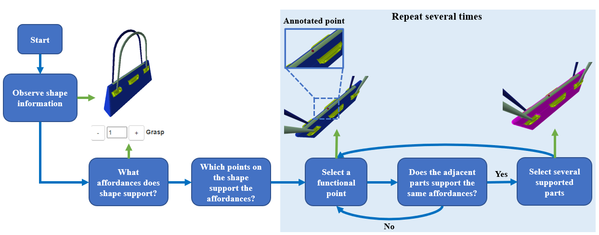
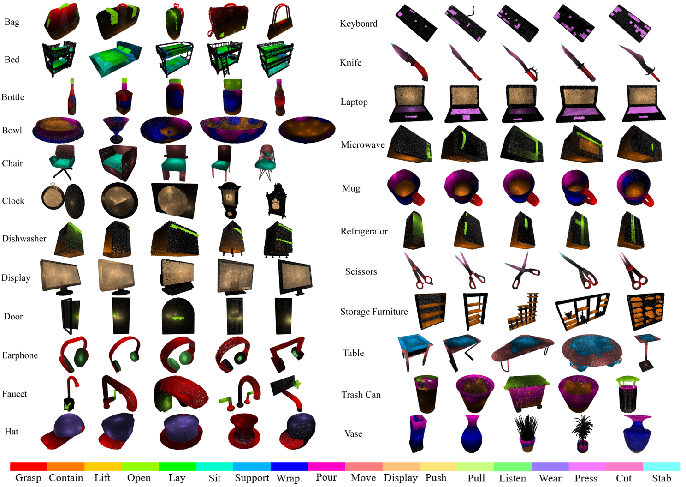

<style> table { margin: auto; } </style>
# <center>3D AffordanceNet: A Benchmark for Visual Object Affordance Understanding</center>
<center>Shengheng Deng<sup>1</sup>, Xun Xu<sup>2</sup>, Chaozheng Wu<sup>1</sup>, Ke Chen<sup>1</sup>, Kui Jia<sup>1</sup></center>
<center><sup>1</sup>South China University of Technology <sup>2</sup>I2R ASTAR</center>

## Abstract
The ability to understand the ways to interact with objects from visual cues, a.k.a. visual affordance, is essential to vision-guided robotic research. This involves categorizing, segmenting and reasoning of visual affordance. Relevant studies in 2D and 2.5D image domains have been made previously, however, a truly functional understanding of object affordance requires learning and prediction in the 3D physical domain, which is still absent in the community. In this work, we present a `3D AffordanceNet` dataset, a benchmark of 23k shapes from 23 semantic object categories, annotated with 18 visual affordance categories. Based on this dataset, we provide three benchmarking tasks for evaluating visual affordance understanding, including `full-shape`, `partial-view` and `rotation-invarian`t affordance estimations. Two state-of-the-art point cloud deep learning networks are evaluated on all tasks. In addition we also investigate a `semi-supervised learning` setup to explore the possibility to benefit from unlabeled data. Comprehensive results on our contributed dataset show the promise of visual affordance understanding as a valuable yet challenging benchmark.  

## Dataset
### 1. Data Collection

<center>Figure 1. The annotation workflow</center>

- We created a web-based `3D GUI` for collecting raw annotations. The process of annotation is designed to be a question-answering workflow as illustrated in Fig. 1. A user is given one shape at a time visualized in 3D. Individual parts are colored according to the pre-defined colormap in the PartNet dataset. Annotators are allowed to freely rotate, translate and change the scale of the shape using a mouse, which allows the annotators to observe the shape more extensively (*Observe Shape information*). After observing the shape information, annotators are first asked to determine the supported affordances by choosing from a list (*What affordances does shape support?*). Annotators are further asked to select keypoints that support the specified affordance (*What points on the shape support the affordances?*). At least 3 keypoints will be labeled by one annotator for each affordance.

### 2. Statistics
- `3D AffordanceNet` provides well-defined visual affordance score map annotations for ***22949*** shapes from ***23*** shape categories with at most ***5*** affordance types defined for each category. From the perspective of affordance categories, `3D AfffodanceNet` contains ***56307*** affordance annotations from ***18*** affordance classes. `3D AffordanceNet` dataset and annotations are of **multi-class** and **multi-label**, meaning that the labels are not mutually exclusive and each individual point can be labeled positive for multiple affordances. All shapes in `3D AffordanceNet` are from PartNet. Tab. 1 and Tab. 2 show the affordance dataset statistics. The `3D AffordanceNet` dataset is split into the train, validation, and test sets with a ratio of ***70\%***, ***10\%***, and ***20\%***, respectively according to the shape semantic category.

|       Object      |               Affordance               |  Num |    Object    |            Affordance            |  Num |
|:-----------------:|:--------------------------------------:|:----:|:------------:|:--------------------------------:|:----:|
|        Bag        |       grasp, lift, contain, open       |  125 |   Keyboard   |               press              |  156 |
|        Bed        |            lay, sit, support           |  181 |     Knife    |         grasp, cut, stab         |  314 |
|        Bowl       |        contain, wrap-grasp, pour       |  187 |    Laptop    |          display, press          |  421 |
|       Clock       |                 display                |  524 |   Microwave  |      open, contain, support      |  184 |
|     Dishwasher    |              open, contain             |  166 |      Mug     | contain, pour, wrap-grasp, grasp |  190 |
|      Display      |                 display                |  887 | Refrigerator |           contain, open          |  185 |
|        Door       |            open, push, pull            |  220 |     Chair    |        sit, support, move        | 6113 |
|      Earphone     |              grasp, listen             |  223 |   Scissors   |         grasp, cut, stab         |  68  |
|       Faucet      |               grasp, open              |  628 |     Table    |           support, move          | 7990 |
|        Hat        |               grasp, wear              |  222 |   Trash Can  |        contain, pour, open       |  315 |
| Storage Furniture |              contain, open             | 2186 |     Vase     |     contain, pour, wrap-grasp    | 1048 |
|       Bottle      | contain, open, wrap-grasp, grasp, pour |  411 |              |                                  |      |

<center> Table 1. 3D AffordanceNet Statistics. The Object column shows the object category. The Affordance column shows the defined affordance classes for each category. The Num column shows the amount of each shape semantic category. </center>

|     | Support |  Move |  Sit | Contain |  Open  | Grasp | Pour | Display | Wrap-Grasp |
|:---:|:-------:|:-----:|:----:|:-------:|:------:|:-----:|:----:|:-------:|:----------:|
| **Num** |  14848  | 14540 | 6516 |   5155  |  4506  |  2253 | 2086 |   1914  |    1889    |
|         | **Press**  |  **Cut**  | **Stab** |   **Wear**  | **Listen** |  **Pull** | **Push** |   **Lay**   |    **Lift**    |
| **Num** |   588   |  393  |  393 |   231   |   228  |  225  |  225 |   194   |     123    |

<center>Table 2. 3D AffordanceNet Statistics. The Num rows show the number of affordance annotations of each affordance category provided by 3D AffordanceNet</center>

### 3. Visualization

- We present example shapes with propagated affordance ground-truth in Fig. 2.


<center>Figure 2. Ground Truth data visualization</center>

### 4. Resources
- Paper link:
- Code of the experiments in paper: <https://github.com/Gorilla-Lab-SCUT/AffordanceNet>
- `3D AffordanceNet` download link:  

## Tasks and Benchmarks
### 1. Evaluation Metrics
- We evaluate four metrics for three affordance estimation tasks, mean Average Precision (`mAP`) scores, mean squared error (`MSE`), mean Area Under Curve (`mAUC`), and average Intersection Over Union (`aIoU`). Except for the MSE, all the other metrics for each category are averaged over all shapes, a.k.a. macro-average.
- For each affordance category, the ground-truth map is binarized with 0.5 threshold for all evaluations.
- For `mAP`, we calculate the Precision-Recall Curve and AP is calculated for each affordance. Then the `mAP` is the average over the AP of all affordance categories.
- For `mAUC`, we calculate the area under ROC Curve (AUC) for each affordance. Then the `mAUC` is the average over the AUC of all affordance categories.
- For `MSE`, we calculated the mean squared error of each affordance category and sum up the results from all affordance categories. 
- For `aIoU`, we gradually tune up the threshold from 0 to 0.99 with 0.01 step to binarize the prediction, and the aIoU is the arithmetic average of all IoUs at each threshold. 

### 2. Full-Shape Affordance Estimation

- Given an object without knowing the affordances supported by the object, the `full-shape` affordance estimation task aims to estimate the supported affordance type and predict the point-wise probabilistic score of affordance for complete 3D point clouds.

|            | mAP(%) | mAUC(%) | aIOU(%) |  MSE  |
|:----------:|:------:|:-------:|:-------:|:-----:|
| PointNet++ |  48.0  |   87.4  |   19.3  | 0.059 |
|    DGCNN   |  46.4  |   85.5  |   17.8  | 0.080 |
|            |        |         |         |       |
|            |        |         |         |       |
|            |        |         |         |       |

### 3. Partial-View Affordance Estimation

- We can only expect partial view of 3D shapes, represented as partial point cloud in real-world application scenarios. `Partial-View` affordance estimation is concerned with the estimation of affordance from partial point cloud. 
- In specific, because all shapes are well aligned within the (-1,-1,-1) to (1,1,1) cube, we set up 4 affine cameras located at (1,1,1), (-1,-1,1), (1,-1,-1), (-1,1,-1) in Cartesian coordinate system, facing towards the origin, to obtain the partial-view point clouds. We estimate the affordance on the visible partial point cloud only.

|            | mAP(%) | mAUC(%) | aIOU(%) |  MSE  |
|:----------:|:------:|:-------:|:-------:|:-----:|
| PointNet++ |  45.7  |   85.2  |   16.9  | 0.062 |
|    DGCNN   |  42.2  |   83.7  |   13.8  | 0.069 |
|            |        |         |         |       |
|            |        |         |         |       |
|            |        |         |         |       |

### 4. Rotation-Invariant Affordance Estimation

- The shapes in `3D AffordanceNet` are all aligned in canonical poses, however, the data observed by sensors in the real world are not always in canonical poses. The difference in rotation between real data and training data will lead to a performance drop in real-world usage. `Rotation-Invariant` affordance estimation aims to estimate the affordance of rotated objects.
- We propose two different rotation settings: $z/z$ and $SO(3)/SO(3)$ where $z/z$ means rotation is applied along z axis only for both training and inference stages while $SO(3)/SO(3)$ refers to $SO(3)$ rotation, i.e. freely rotation along x, y and z axes.

|    $z/z$   | mAP(%) | mAUC(%) | aIOU(%) |  MSE  |
|:----------:|:------:|:-------:|:-------:|:-----:|
| PointNet++ |  47.3  |   87.0  |   18.7  | 0.06 |
|    DGCNN   |  44.8  |   84.9  |   16.1  | 0.074 |
|            |        |         |         |       |
|            |        |         |         |       |
|            |        |         |         |       |

|    $SO(3)/SO(3)$   | mAP(%) | mAUC(%) | aIOU(%) |  MSE  |
|:----------:|:------:|:-------:|:-------:|:-----:|
| PointNet++ |  41.8  |   83.3  |   15.2  | 0.072 |
|    DGCNN   |  37.3  |   78.9  |   12.8  | 0.08  |
|            |        |         |         |       |
|            |        |         |         |       |
|            |        |         |         |       |

## Reference
- Mo, Kaichun, et al. "Partnet: A large-scale benchmark for fine-grained and hierarchical part-level 3d object understanding." Proceedings of the IEEE/CVF Conference on Computer Vision and Pattern Recognition. 2019.
- Wang, Yue, et al. "Dynamic graph cnn for learning on point clouds." Acm Transactions On Graphics (tog) 38.5 (2019): 1-12.
- Qi, Charles R., et al. "Pointnet++: Deep hierarchical feature learning on point sets in a metric space." arXiv preprint arXiv:1706.02413 (2017).

## Cite Us
```

```